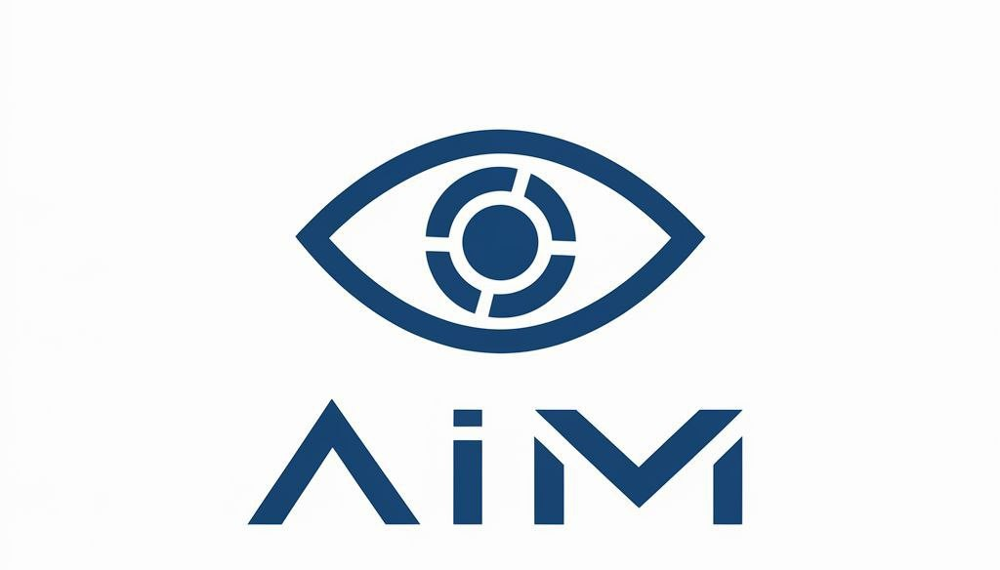

<h2> Hi, It's Human-Profile-Builder! </h2>
<h5>Hackathon: InnoHack 2024</h5>

 

***Human-Profile-Builder** - это проект, разработанный командой Artificial Intelligence Menace для хакатона InnoHack 2024. Этот инструмент предназначен для построения профилей людей на основе различных данных.*

###  Установка

1. Клонируйте репозиторий:
***git clone https://github.com/ArtificialIntelligenceMenace/Human-Profile-Builder.git***
***cd Human-Profile-Builder***

2. Соберите Docker-образ:
***docker-compose build***

3. Запустите контейнер:
***docker-compose up***

## Использование

Чтобы запустить основной скрипт проекта отдельно вне docker:

***python main.py***

## Конфигурация

Проект использует файл `requirements.txt` для определения зависимостей. Вы можете редактировать этот файл для добавления новых библиотек или изменений версий.

pandas==2.2.3
recordlinkage==0.16
six==1.16.0
progress==1.6

- - -

<em>ML разработчик <a href="https://t.me/NoxRessurected">Даниил Мельников </a> 
Containerization Engineer <a href="https://t.me/faster_name8322000">Федор Заволокин </a> 
Дизайнер, разработчик
 <a href="https://t.me/c1cadaCE5">Иван Рябинин </a>
</em>

